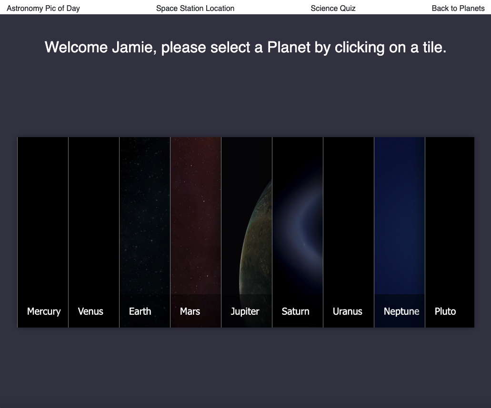
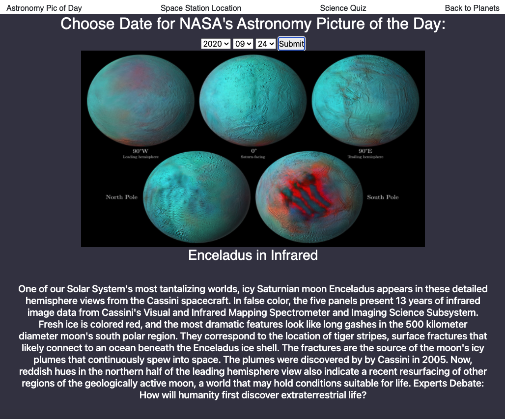
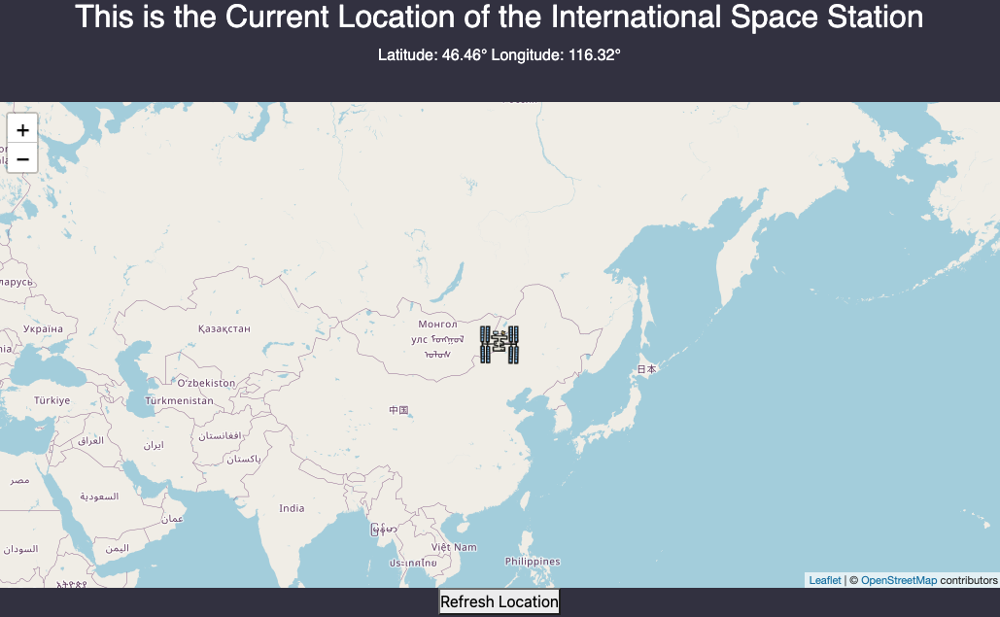

## Rails framework as an API for backend and Vanilla JavaScript 

# Moonlight
Signup and explore our Solar Systems Planets and Moons. Check out the NASA picture of the day, International Space Station's location, or take a fun Science or Math based Quiz. 

### Description
This is a single page application that allows Users to signup and explore our Solar Systems Planets and Moons. They can also check out the NASA picture of the day, check out the International Space Station's location, and take a fun Science or Math based Quiz. 

# Jamie Vullo - Full-Stack Software Engineer - www.jamievullo.com